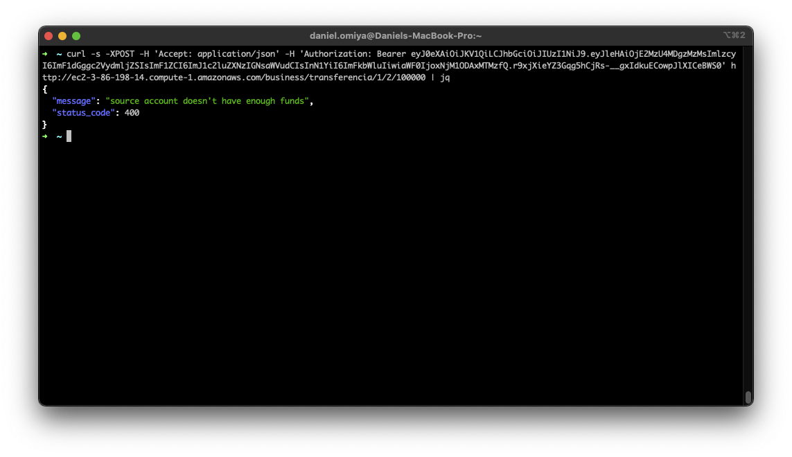

# distr-bank-webservice

Serviço distribuído de banco.

## Contribuidor

- Daniel Omiya - [41995449](mailto:41995449@mackenzista.com.br) (aka @gwyddie)

## Serviços

Pensando em fornecer uma maior autonomia a cada um dos serviços, nenhum deles compartilham código entre si. Cada um dos três serviços está segregado em um dos diretórios a seguir.

- [auth](services/auth)
- [accounts](services/accounts)
- [data](services/data)

## Arquitetura implementada

O _setup_ para realização de testes foi feito usando 6 instâncias de `t2.micro` da AWS, sendo elas:

- 1 máquina para o serviço de dados
- 1 máquina para o serviço de autenticação
- 3 máquinas para o serviço de negócio
- 1 máquina para o balanceador de carga (_front-end_ com `nginx`)

Nesse cenário, o balanceador de carga distribui as requisições no _path_ `/business/` entre os servidores de negócio e, no _path_ `/auth/`, para o servidor de autenticação.

## Telas do sistema em execução

Todos os clientes precisam de um _token_ para interagir com o sistema, para isso, foi criado um serviço de `auth`, que gera um JWT, assim podendo ser autenticado pelos demais serviços. Abaixo, a obtenção desse _token_ a partir do balanceador de carga.

Conferência do saldo de uma conta (já com o _token_ obtido no processo anterior).

Realizando uma transferência entre contas.

Tentativa de realizar uma transferência sem possuir fundos o bastante para tal.

Realizando a operação de saque.

Tentando realizar o saque sem possuir fundos o bastante para tal.

Realizando a operação de depósito.

Exemplo da saída de _logs_ do servidor de dados.

### Outras telas

_Status_ do `nginx` e _logs_ gerados pelo balanceador de carga.

## TO DO

- melhoria nos logs no servidor de negócio
- persistir em arquivos os dados do servidor de dados
- adição de testes unitários a todos os serviços
- parametrizar o serviço de `auth` para remover os "códigos chumbados"
- fazer o serviço de `auth` consultar o serviço de dados antes de criar novos _tokens_
- _front-end_ com HTML/CSS (?)

---

_That's all, folks!_
